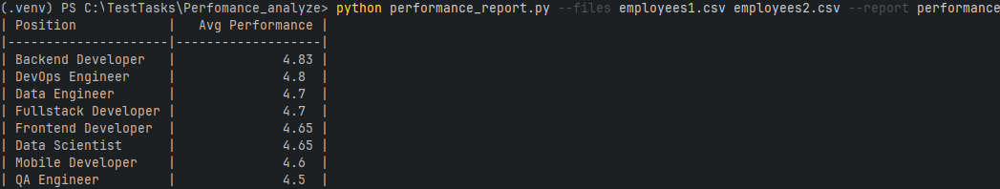

# Performance Reports CLI

Короткий консольный инструмент для генерации различных отчётов по данным из CSV-файлов.  
Проект использует только стандартную библиотеку Python (argparse, csv и др.),  
при этом архитектура позволяет быстро добавлять новые типы отчётов.

## Установка
1. Склонировать репозиторий
   `https://github.com/Gulyash1/perfomance_report.git`
2. Перейти в папку
   `cd perfomance_report`
4. Установить зависимости
   `pip install -r requirements.txt`
6. Запустить скрипт
   ` python main.py --files <paths_to_files> --report <report_name>`
   Заменить `paths_to_files` на пути до файлов (или названия файлов, если находятся в той же папке),
   `report_name` заменить на название отчёта.

## Пример запуска
`python main.py --files data1.csv data2.csv --report performance`\




## Добавление отчётов

Вся логика расширения сводится к добавлению новой функции и регистрации её в словаре `REPORTS`.
```
def build_skills_report(rows):
    ...
    return result

REPORTS = {
    "performance": build_data,
    "skills": build_skills_report,
}

```


## Запуск тестов
`python -m pytest -v`
